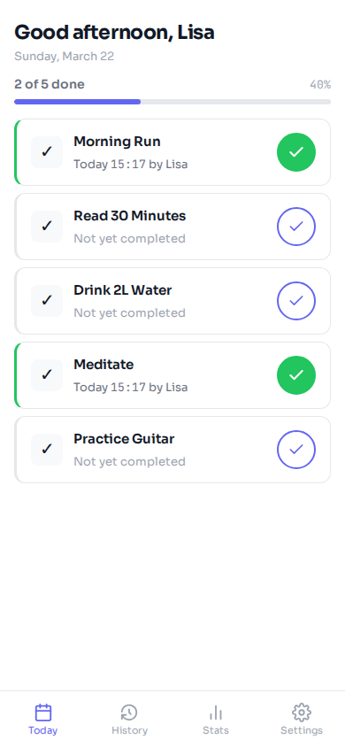
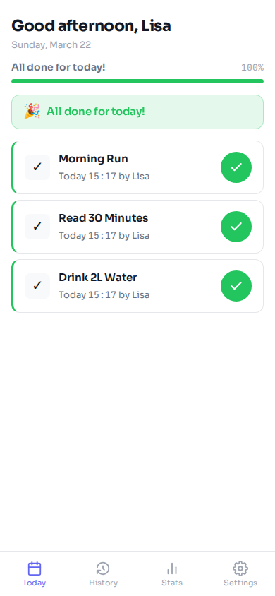
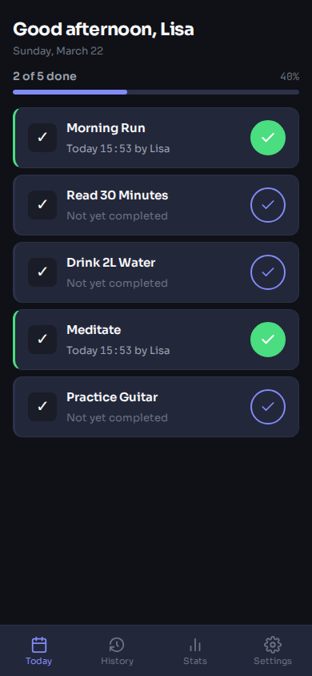
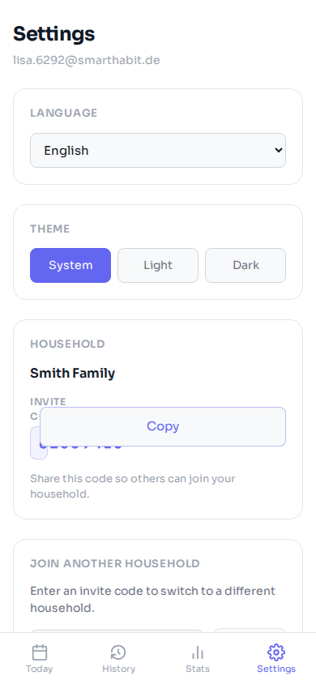
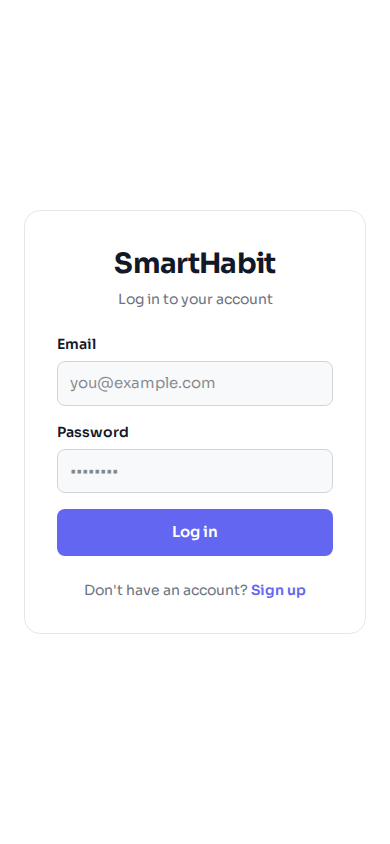
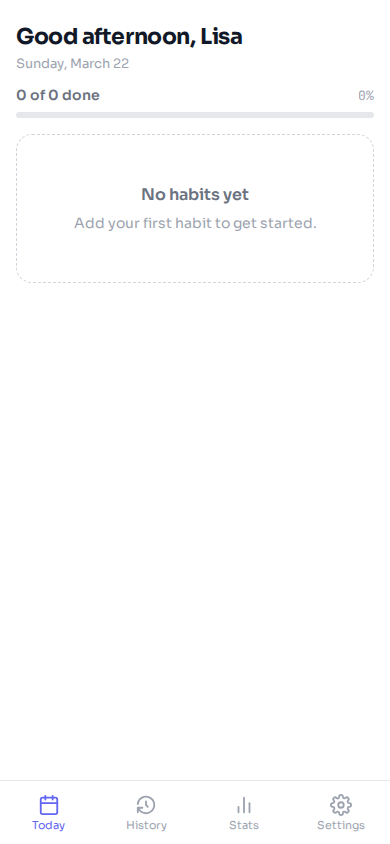
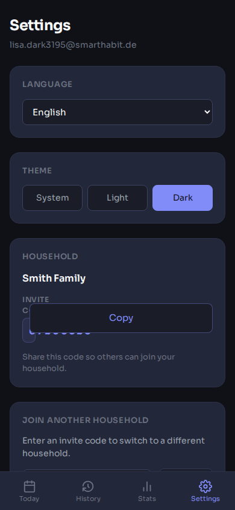
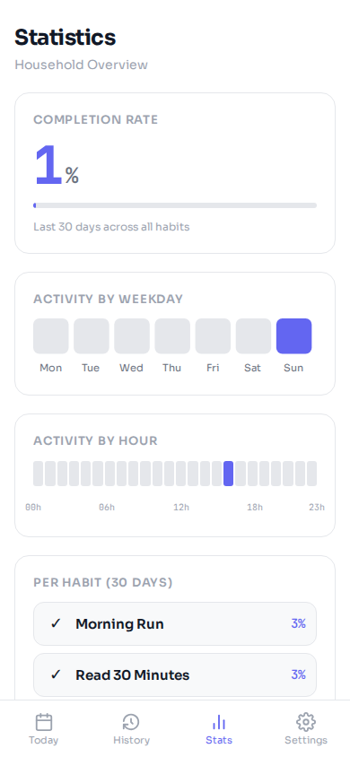

# SmartHabit Tracker

[](https://github.com/tony-stark-eth/smarthabit-tracker/actions/workflows/ci.yml)
[](https://github.com/tony-stark-eth/smarthabit-tracker/actions/workflows/ci-frontend.yml)
[](https://github.com/tony-stark-eth/smarthabit-tracker/actions/workflows/ci-e2e.yml)
[](https://github.com/tony-stark-eth/smarthabit-tracker/actions/workflows/ci-lighthouse.yml)

Household habit tracking app with adaptive notifications. Track daily habits, get smart reminders based on your patterns, and share progress with your household.

<p align="center">
  
  
  
  
</p>

## Features

- **One-tap habit logging** with optimistic UI and real-time household sync (Mercure SSE)
- **Adaptive notifications** — MAD algorithm learns your optimal time windows from 21 days of data
- **Multi-transport push** — Web Push (PWA), ntfy (Android), APNs (iOS)
- **Household isolation** — security voter checks every API access for household scope
- **Statistics** — streaks, completion rates, weekday/hourly heatmaps
- **Dark mode** — Neo Utility design with Sora + JetBrains Mono fonts
- **GDPR from day 1** — consent tracking, data export, account deletion
- **PWA** — installable, works offline with queue-based sync
- **Capacitor-ready** — native iOS/Android shell with platform-aware push

## Tech Stack

| Layer | Technologies |
|---|---|
| **Backend** | PHP 8.4, Symfony 8, Doctrine ORM, FrankenPHP (Worker Mode) |
| **Frontend** | SvelteKit 2, Svelte 5, Bun, TypeScript strict, Tailwind 4 |
| **Database** | PostgreSQL 17, PgBouncer (Transaction Mode) |
| **Push** | Web Push (minishlink), ntfy (self-hosted), APNs (direct HTTP/2) |
| **Real-time** | Mercure (SSE, built into Caddy) |
| **Quality** | PHPStan max + 10 extensions, Rector, ECS, Infection (93% MSI) |
| **Tests** | 233 unit/integration + 38 E2E (Playwright) |
| **CI/CD** | GitHub Actions (5 workflows), GHCR, SSH deploy |
| **Infrastructure** | OpenTofu (Hetzner), Let's Encrypt via Caddy |

## Quick Start

```bash
# Start everything (composer install runs automatically)
docker compose --profile dev up -d

# Run backend quality checks
docker compose exec php vendor/bin/ecs check
docker compose exec php vendor/bin/phpstan analyse
docker compose exec php vendor/bin/phpunit

# Run E2E tests
cd frontend && bun install && bun run test:e2e
```

## Screenshots

| Login | Empty Dashboard | Progress | All Done |
|:---:|:---:|:---:|:---:|
|  |  |  |  |

| Settings (Light) | Settings (Dark) | Dashboard (Dark) | Stats |
|:---:|:---:|:---:|:---:|
|  |  |  |  |

## Architecture

```
backend/src/
  Auth/           User, JWT, password reset, email verification
  Habit/          Habits, logging, time windows, reordering
  Household/      Household entity, invite codes, voter
  Notification/   Push transports (WebPush/ntfy/APNs), cron, messenger
  Stats/          Streaks, completion rates, heatmaps
  Shared/         Health controller, enums, contracts

frontend/src/
  routes/(auth)/  Login, register
  routes/(app)/   Dashboard, settings, stats, history
  lib/api/        API client, push abstraction, offline queue
  lib/stores/     Auth store (Svelte 5 runes)
```

## Make Targets

```bash
make help              # Show all targets
make up                # Start dev stack
make quality           # ECS + PHPStan + Rector + PHPUnit + Infection
make e2e               # Playwright E2E tests
make deploy            # Deploy to production via SSH
make deploy-destroy    # Tear down everything (stops billing)
```

## Deployment

```bash
make deploy-init       # Provision Hetzner VPS + setup
make deploy            # Pull, build, deploy with health check
make deploy-rollback   # Rollback to previous image
make deploy-logs       # Follow production logs
make deploy-destroy    # Destroy everything, zero cost
```

Docker health checks gate deployments — unhealthy containers won't replace healthy ones. The entrypoint handles database readiness and migrations automatically.

See [docs/deployment.md](docs/deployment.md) for details.

## Documentation

| Document | Content |
|---|---|
| [Architecture](docs/architecture.md) | Docker, timezone, data model, API endpoints |
| [Security](docs/security.md) | GDPR, auth flows, rate limiting |
| [Frontend](docs/frontend.md) | SvelteKit PWA, design system, i18n |
| [Notifications](docs/notifications.md) | Push architecture (Web Push, ntfy, APNs) |
| [Statistics](docs/statistics.md) | Stats, analytics, heatmaps |
| [Deployment](docs/deployment.md) | Hetzner, GlitchTip, backups, CD |
| [Capacitor](docs/capacitor.md) | Native app setup, per-platform push |
| [Testing](docs/testing.md) | PHPStan config, test strategy, CI pipeline |

## CI / GitHub Actions

| Workflow | Trigger | What it does |
|---|---|---|
| Backend CI | push/PR | ECS, PHPStan, Rector, PHPUnit+Infection (parallel) |
| Frontend CI | push/PR | Svelte Check, ESLint, Build |
| E2E Tests | push/PR | Full Docker stack + Playwright (38 tests) |
| Lighthouse | push/PR (frontend) | Performance, a11y, best practices audit |
| Deploy | push to main | CI gate, build prod image, GHCR, SSH deploy |

## Built With

Forked from [template-symfony-sveltekit](https://github.com/tony-stark-eth/template-symfony-sveltekit) — an opinionated full-stack template with production-ready quality tooling from commit zero.

## License

[MIT](LICENSE) — Copyright (c) 2026 tony-stark-eth
